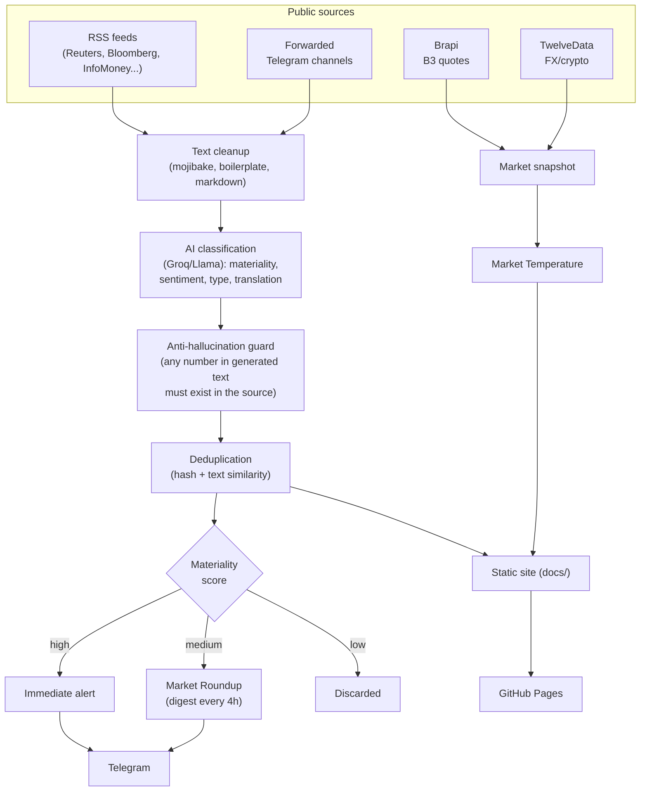

# Antes do Sino — bot

Automated pipeline for Brazilian financial market news. Reads RSS feeds, classifies and translates news with AI (Groq), publishes to Telegram, and generates the static site (`docs/`, GitHub Pages).

Not an SPA, no build step — see `CLAUDE.md` for the project's permanent rules (real stack, what can and can't change).

**[Leia isso em português →](README.md)**

## About this project (case study)

### The problem

Retail-facing financial content in Brazil tends toward two extremes: an unfiltered firehose of headlines with no materiality signal, or oversimplified "buy/sell" calls with no transparency about where a number came from. Antes do Sino started as a portfolio project (for market-intelligence, IR, research and sales-trading roles) built against both problems: it scores what actually matters, tags what's confirmed versus rumored versus opinion, and never generates a number that isn't traceable back to its source.

### Architecture



The whole pipeline runs inside `main.py`, triggered every few minutes by an external cron via `workflow_dispatch` (see [How the bot runs](#how-the-bot-runs) below). `editorial_foundation.py` and `market_data_provider.py` are isolated modules (they never import `main.py` back) — the first holds the "shadow mode" layer (metrics that never affect real publication), the second is a factory/DI pattern for market-data sources, used today only by Brapi.

### Engineering decisions

- **No framework, no build step, on purpose.** Hand-written HTML/CSS/vanilla JS, free hosting on GitHub Pages, one shared `design-system.css` (color/spacing tokens, dark/light theme) across every page.
- **Numeric anti-hallucination guard.** Every AI-generated synthesis (translation, executive summary) is checked by comparing every number in the generated text against the source text, via a digit fingerprint (immune to pt-BR/en-US decimal-separator swaps) — any number that doesn't match is dropped, never published.
- **Never invent a missing data point.** When there's no free, reliable source for an indicator, the screen either says so explicitly (labeled as a proxy) or the number simply doesn't appear — never a placeholder pretending to be real data.
- **Consent before analytics.** Google Analytics only loads after the user explicitly accepts (cookie banner) — before that, no third-party cookie is created.
- **Widgets loaded on demand.** Every TradingView widget (Terminal, Radar, heatmap, calendar, quant screener) goes through one shared function (`theme.js::montarWidgetTV`) — that made it possible to add `IntersectionObserver`-based lazy loading across every page in one change, instead of touching each page individually.
- **Derivatives simulator, fully client-side.** There's no free, real-time B3 options-chain data source — instead of inventing one or scraping, the spread/collar/protective-put simulator computes the payoff purely from the numbers the user provides.

### Screenshots


*Radar de Abertura (home): market temperature (with history and a "since the last reading" comparison), essential indicators, and news tagged by reliability and by the assets/sectors it relates to.*


*Structure simulator (bull/bear spread, collar, protective put): max-profit/max-loss and break-even computed numerically, payoff chart in inline SVG with no external library.*

### Known limitations

- **No automated test suite** (not even pytest). Validation is manual: `py_compile` + ad hoc scripts per change + real Playwright checks for UI — see `CLAUDE.md`.
- **`dados-terminal.html` is still a monolithic HTML file (~285 KB)**, not paginated or compressed into JSON — identified as a next step, not implemented yet (a bigger architectural change touching `generate_portal` in `main.py` and the parsing logic in `terminal.js`/`radar.js` at once).
- **Fundamentals from CVM open data (DFP/ITR) and a Material Facts / Market Announcements feed are not implemented.** The development environment used for this phase of the project had no network access to `dados.cvm.gov.br`/`b3.com.br` to verify the real data format before writing a parser — pending an environment with real access (e.g. inside GitHub Actions itself) before implementing.
- **OBM (official foreign capital flow) unavailable.** No documented public API — treated as unavailable, never scraped or reverse-engineered (see `CLAUDE.md` rule 5).
- **`social/` (the social content engine) uses an older visual palette** (blue), predating the site's current redesign (navy + gold) — an isolated, working module, just not a current priority (the focus right now is the informational product, not social growth).

### Next steps

1. Financial fundamentals from CVM (DFP/ITR) with sector comparison, once there's a validated network-access environment.
2. Material Facts and Market Announcements feed.
3. Replace `dados-terminal.html` with a paginated/compressed JSON format.
4. A basic automated test suite (pytest) for the pipeline's pure functions (parsing, classification, payoff calculation).

## How the bot runs

`main.py` runs via the GitHub Action `.github/workflows/bot.yml`, triggered externally (cron-job.org → `workflow_dispatch`) every few minutes. There's no `schedule:` in the workflow — the real cadence comes from the external trigger, not GitHub Actions.

Within each run, the bot only processes anything if it's inside the **operating window** (`dentro_da_janela_de_operacao()`): **06:40 to 22:30**, Brasília time (`America/Sao_Paulo`). Outside that window, the cycle is skipped without consuming any API.

## Environment variables

Configured as repository *secrets* and passed through by the workflow:

| Variable | Required | Description |
|---|---|---|
| `TELEGRAM_BOT_TOKEN` | yes | Telegram bot token. The bot won't run without it. |
| `TELEGRAM_CHAT_ID` | yes | Chat/channel where real messages are published. |
| `TELEGRAM_ADMIN_CHAT_ID` | no | Separate chat for social-content-engine approvals and manual-review notifications (high-impact sensitive topics). Without it, those notifications are a silent no-op — doesn't affect the main channel. |
| `GROQ_API_KEY` | no | Enables AI classification/translation/synthesis (`USE_AI`). Without it, the bot still publishes (original title/body, no translation or materiality score). |
| `BRAPI_TOKEN` | no | Brazilian stock quotes (Brapi). |
| `TWELVEDATA_API_KEY` | no | FX/crypto quotes (TwelveData). |
| `FRED_API_KEY` | no | Federal Reserve series (FRED) — **not configured today**; without it, this data stays unavailable. |
| `DRY_RUN` | no | `true`/`1`/`yes` generates full messages in the log **without sending** to Telegram. Default `false` (normal production). |
| `FORCE_MORNING_BRIEFING` | no | `true`/`1`/`yes` forces the Morning Briefing even outside the window, off a business day, or already sent today. Default `false`. |
| `MORNING_BRIEFING_HORA` / `MORNING_BRIEFING_MINUTO` | no | Target time for the Morning Briefing. Default `6`/`50` (06:50). The tolerance window (-10min/+20min) is computed from that target. |

## Publication scheduling

All of them follow the same pattern: state persisted in `docs/*.json` (committed by the bot itself every cycle), sent at most once per B3 business day (national holidays excluded, `eh_dia_util_b3()`).

| Publication | Window (BR_TZ) | State |
|---|---|---|
| **Morning Briefing** (`tipo="abertura"`) | 06:40–07:10 (target 06:50, configurable) | `docs/morning_briefing_state.json` |
| Market snapshot | 12:00–12:15 | `docs/snapshot_state.json` |
| B3 close (Evening Briefing) | 18:15–18:45 | `docs/briefings_state.json` |
| Night close (Night Wrap) | 22:20–22:30 (always the last message of the day) | `docs/night_wrap_state.json` |
| Market Roundup | every 4h, only publishes if there's something queued | `docs/giro_state.json` |
| Essential alerts (breaking) | immediate, max 3/day | `docs/breaking_state.json` |

### Morning Briefing — details

- **Lock against concurrent execution**: `docs/morning_briefing.lock`, created atomically (`os.open` with `O_CREAT|O_EXCL`). A lock older than 10 minutes is considered orphaned (a previous run got stuck) and is released automatically.
- **Send retry**: up to 3 attempts with a 5s wait between them. If all fail, the state isn't marked as sent — the next run inside the window tries again.
- **Content**: reuses calculations that already exist in the pipeline — `compute_market_temperature` (Market Temperature, the same function used by the site's Radar de Abertura), `compute_news_clusters` and `build_sellside_synopsis` (assets to watch / risks, the same functions used by the B3 close briefing). Never invents a reading without enough data — every section shows an honest sentence ("Awaiting data", "No events scheduled today", etc.) when there's no real information available.

## How to test

No automated suite (pytest) — validation is manual, per `CLAUDE.md`:

```bash
# 1. Syntax
python3 -m py_compile main.py

# 2. Local dry run (generates the full messages in the console, sends nothing)
DRY_RUN=true python3 main.py

# 3. Force the Morning Briefing outside the window/day (combine with DRY_RUN
#    to never publish for real during a manual test)
DRY_RUN=true FORCE_MORNING_BRIEFING=true python3 main.py
```

Locally (outside GitHub Actions) you need to install the dependencies first: `pip install -r requirements.txt`.

### Via GitHub Actions

**Actions** tab → workflow "Antes do Sino - Bot de Notícias" → **Run workflow** → check `dry_run` and/or `force_morning_briefing` as needed. The external trigger (cron-job.org) never passes these inputs, so real production is never affected by them.

## Pipeline structure

`main.py` runs sequentially (each block isolated in its own `try/except` — one broken source never brings down the whole cycle):

1. RSS collection (`FEEDS`) + Telegram channel forwarder.
2. Text cleanup (`strip_html_tags`, `fix_mojibake`, `sanitize_message_text`, `strip_boilerplate`).
3. AI classification (`classify_news_ai`): relevance, sentiment, translation, materiality score, "why it matters", content type (fact/opinion/interview), sensitive topic.
4. Deduplication (URL/title hash + text similarity).
5. Dispatch decision (`decide_dispatch_tier`): breaking / round (roundup) / discard, with daily caps and a downgrade for unconfirmed sources.
6. Scheduled publications (see table above).
7. Static site generation (`docs/`).

`editorial_foundation.py` is an isolated module (never imports `main.py` back) holding the "shadow mode" layer — logging/metrics that never affect real publication.
