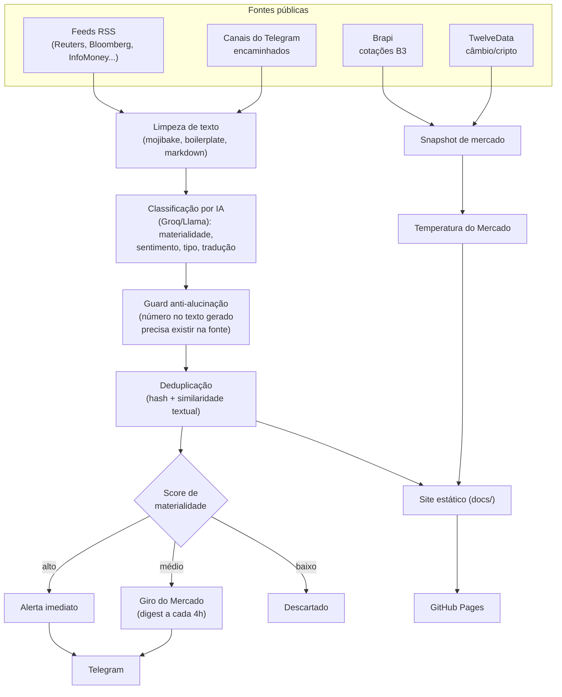
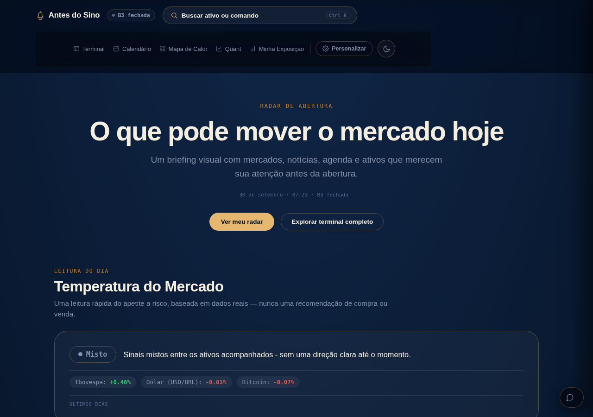
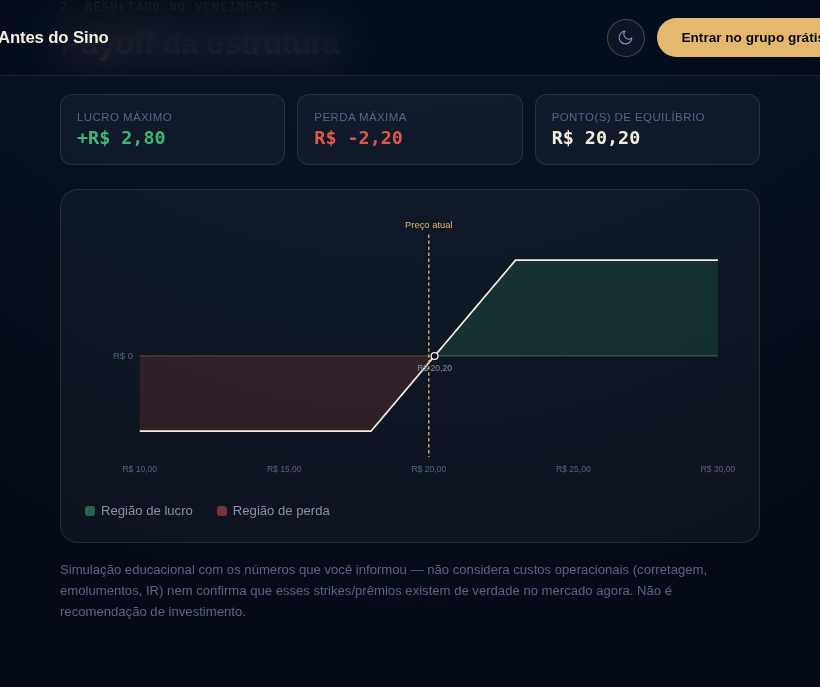

# Antes do Sino — bot

Bot de notícias financeiras do mercado brasileiro. Lê feeds RSS, classifica e traduz notícias via IA (Groq), publica no Telegram e gera os arquivos estáticos do site (`docs/`, GitHub Pages).

Não é uma SPA nem tem build step — veja `CLAUDE.md` para as regras permanentes do projeto (stack real, o que pode e não pode mudar).

**[Read this in English →](README.en.md)**

## Sobre este projeto (case)

### O problema

Conteúdo financeiro voltado a varejo no Brasil tende a dois extremos: um fluxo bruto de manchetes sem nenhum sinal de materialidade, ou recomendações simplificadas de "compra/venda" sem transparência sobre de onde vem cada número. O Antes do Sino nasceu como um projeto de portfólio (para vagas de inteligência de mercado, RI, research e sales trading) construído contra os dois problemas: pontua o que realmente importa, marca o que é confirmado/rumor/opinião, e nunca gera um número que não seja rastreável até a fonte.

### Arquitetura



Todo o pipeline roda em `main.py`, disparado a cada poucos minutos por um cron externo via `workflow_dispatch` (ver [Como o bot roda](#como-o-bot-roda) abaixo). `editorial_foundation.py` e `market_data_provider.py` são módulos isolados (nunca importam `main.py` de volta) — o primeiro guarda o "modo sombra" (métricas que não afetam a publicação real), o segundo é um padrão factory/DI pra fonte de cotação, hoje só usado pela Brapi.

### Decisões técnicas

- **Sem framework, sem build step, de propósito.** HTML/CSS/JS vanilla, hospedagem gratuita no GitHub Pages, um único `design-system.css` (tokens de cor/espaçamento, tema claro/escuro) compartilhado por toda página.
- **Guard anti-alucinação numérica.** Toda síntese gerada por IA (tradução, resumo executivo) passa por uma checagem que compara cada número do texto gerado contra o texto fonte, por fingerprint de dígitos (imune a troca de separador decimal pt-BR/en-US) — número que não bate é descartado, nunca publicado.
- **Nunca inventar dado ausente.** Sem fonte gratuita confiável pra um indicador, ou a tela mostra isso explicitamente (proxy assumido) ou o número simplesmente não aparece — nunca um placeholder fingindo ser dado real.
- **Consentimento antes de analytics.** Google Analytics só carrega depois que o usuário aceita explicitamente (faixa de cookies) — antes disso, nenhum cookie de terceiro é criado.
- **Widgets carregados sob demanda.** Todo widget da TradingView (Terminal, Radar, Mapa de Calor, Calendário, Quant) passa por uma única função compartilhada (`theme.js::montarWidgetTV`) — deu pra adicionar lazy-load via `IntersectionObserver` em todas as páginas de uma vez, sem tocar em cada uma individualmente.
- **Simulador de derivativos 100% client-side.** Não existe fonte gratuita de cadeia de opções da B3 em tempo real — em vez de inventar ou fazer scraping, o simulador de trava/collar/put protetora calcula o payoff só com os números que o próprio usuário informa.

### Capturas de tela


*Radar de Abertura: temperatura do mercado (com histórico e comparação "desde a última leitura"), indicadores essenciais e notícias com etiqueta de confiabilidade e relação com ativo/setor.*


*Simulador de estruturas (trava de alta/baixa, collar, put protetora): métricas de lucro/perda máxima e ponto de equilíbrio calculadas numericamente, gráfico de payoff em SVG sem biblioteca externa.*

### Limitações conhecidas

- **Sem suíte de testes automatizada** (nem pytest). Validação é manual: `py_compile` + scripts ad hoc por mudança + Playwright real pra UI — ver `CLAUDE.md`.
- **`dados-terminal.html` ainda é um HTML monolítico (~285 KB)**, não paginado nem comprimido em JSON — identificado como próximo passo, não implementado ainda (mudança de arquitetura maior, que toca `generate_portal` em `main.py` e a lógica de parse em `terminal.js`/`radar.js` ao mesmo tempo).
- **Fundamentos via dados abertos da CVM (DFP/ITR) e feed de Fatos Relevantes/Comunicados ao Mercado não estão implementados.** O ambiente de desenvolvimento usado nesta fase do projeto não tinha acesso de rede a `dados.cvm.gov.br`/`b3.com.br` pra verificar o formato real dos dados antes de escrever o parser — pendente de um ambiente com acesso real (ex: dentro do próprio GitHub Actions) antes de implementar.
- **OBM (fluxo estrangeiro oficial) indisponível.** Sem API pública documentada — tratado como indisponível, nunca com scraping ou endpoint adivinhado (ver `CLAUDE.md` regra 5).
- **`social/` (motor de conteúdo social) usa uma paleta visual antiga** (azul), anterior ao redesign atual do site (navy + dourado) — módulo isolado, funcional, mas não prioritário no momento (o foco atual é o produto informacional, não crescimento em redes sociais).

### Próximos passos

1. Fundamentos financeiros via CVM (DFP/ITR) com comparação setorial, assim que houver um ambiente com acesso de rede validado.
2. Feed de Fatos Relevantes e Comunicados ao Mercado.
3. Substituir `dados-terminal.html` por um formato JSON paginado/comprimido.
4. Suíte de testes automatizada básica (pytest) para as funções puras do pipeline (parsing, classificação, cálculo de payoff).

## Como o bot roda

`main.py` é executado pela GitHub Action `.github/workflows/bot.yml`, disparada externamente (cron-job.org → `workflow_dispatch`) a cada poucos minutos. Não há `schedule:` no workflow — a cadência real vem do disparo externo, não do GitHub Actions.

Dentro de cada execução, o bot só processa algo se estiver dentro da **janela de operação** (`dentro_da_janela_de_operacao()`): **06h40 às 22h30**, horário de Brasília (`America/Sao_Paulo`). Fora dessa janela o ciclo é ignorado sem consumir nenhuma API.

## Variáveis de ambiente

Configuradas como *secrets* do repositório e repassadas pelo workflow:

| Variável | Obrigatória | Descrição |
|---|---|---|
| `TELEGRAM_BOT_TOKEN` | sim | Token do bot no Telegram. Sem isso o bot não roda. |
| `TELEGRAM_CHAT_ID` | sim | Chat/canal onde as mensagens reais são publicadas. |
| `TELEGRAM_ADMIN_CHAT_ID` | não | Chat separado para aprovações do motor de conteúdo social e para notificações de revisão manual (temas sensíveis de alto impacto). Sem essa variável, essas notificações são um no-op silencioso — não afeta o canal principal. |
| `GROQ_API_KEY` | não | Habilita classificação/tradução/síntese via IA (`USE_AI`). Sem ela, o bot continua publicando (título/corpo originais, sem tradução nem score de materialidade). |
| `BRAPI_TOKEN` | não | Cotações de ações brasileiras (Brapi). |
| `TWELVEDATA_API_KEY` | não | Cotações de câmbio/cripto (TwelveData). |
| `FRED_API_KEY` | não | Séries do Federal Reserve (FRED) — **não configurada hoje**; sem ela, esses dados ficam indisponíveis. |
| `DRY_RUN` | não | `true`/`1`/`yes` gera as mensagens completas no log **sem enviar** ao Telegram. Default `false` (produção normal). |
| `FORCE_MORNING_BRIEFING` | não | `true`/`1`/`yes` força o envio do Briefing de Abertura mesmo fora da janela, fora de dia útil ou já enviado hoje. Default `false`. |
| `MORNING_BRIEFING_HORA` / `MORNING_BRIEFING_MINUTO` | não | Horário alvo do Briefing de Abertura. Default `6`/`50` (06h50). A janela de tolerância (-10min/+20min) é calculada a partir desse alvo. |

## Agendamento das publicações

Todas usam o mesmo padrão: estado persistido em `docs/*.json` (comitado pelo próprio bot a cada ciclo), envio no máximo 1x por dia útil da B3 (feriados nacionais excluídos, `eh_dia_util_b3()`).

| Publicação | Janela (BR_TZ) | Estado |
|---|---|---|
| **Briefing de Abertura** (`tipo="abertura"`) | 06h40–07h10 (alvo 06h50, configurável) | `docs/morning_briefing_state.json` |
| Snapshot de mercado | 12h00–12h15 | `docs/snapshot_state.json` |
| Fechamento B3 (Evening Briefing) | 18h15–18h45 | `docs/briefings_state.json` |
| Fechamento noturno (Night Wrap) | 22h20–22h30 (sempre a última mensagem do dia) | `docs/night_wrap_state.json` |
| Giro do Mercado | a cada 4h, só publica se houver algo na fila | `docs/giro_state.json` |
| Alertas essenciais (breaking) | imediato, máx. 3/dia | `docs/breaking_state.json` |

### Briefing de Abertura — detalhes

- **Lock contra execução simultânea**: `docs/morning_briefing.lock`, arquivo criado atomicamente (`os.open` com `O_CREAT|O_EXCL`). Lock mais velho que 10 minutos é considerado órfão (execução anterior travou) e é destravado sozinho.
- **Retry no envio**: até 3 tentativas com 5s de espera entre elas. Se todas falharem, o estado não é marcado como enviado — a próxima execução dentro da janela tenta de novo.
- **Conteúdo**: reaproveita cálculos já existentes no pipeline — `compute_market_temperature` (Temperatura do Mercado, mesma função usada pelo Radar de Abertura do site), `compute_news_clusters` e `build_sellside_synopsis` (Ativos para acompanhar / Riscos, mesmas funções do Fechamento B3). Nunca inventa leitura sem dado suficiente — cada seção mostra uma frase honesta ("Aguardando dados", "Sem eventos previstos para hoje" etc.) quando não há informação real disponível.

## Como testar

Sem suíte automatizada (pytest) — validação é manual, conforme `CLAUDE.md`:

```bash
# 1. Sintaxe
python3 -m py_compile main.py

# 2. Dry-run local (gera as mensagens no console, sem enviar nada)
DRY_RUN=true python3 main.py

# 3. Forçar o Briefing de Abertura fora da janela/dia (combine com DRY_RUN
#    pra nunca publicar de verdade durante teste manual)
DRY_RUN=true FORCE_MORNING_BRIEFING=true python3 main.py
```

Local (fora do GitHub Actions) é preciso instalar as dependências primeiro: `pip install -r requirements.txt`.

### Pelo GitHub Actions

Aba **Actions** → workflow "Antes do Sino - Bot de Notícias" → **Run workflow** → marcar `dry_run` e/ou `force_morning_briefing` conforme o teste desejado. O disparo externo (cron-job.org) nunca passa esses inputs, então a produção real nunca é afetada por eles.

## Estrutura do pipeline

`main.py` roda em sequência (cada bloco isolado em seu próprio `try/except` — uma fonte quebrada nunca derruba o ciclo inteiro):

1. Coleta RSS (`FEEDS`) + encaminhador de canais do Telegram.
2. Limpeza de texto (`strip_html_tags`, `fix_mojibake`, `sanitize_message_text`, `strip_boilerplate`).
3. Classificação via IA (`classify_news_ai`): relevância, sentimento, tradução, score de materialidade, "por que importa", tipo de conteúdo (fato/opinião/entrevista), tema sensível.
4. Deduplicação (hash de URL/título + similaridade textual).
5. Decisão de despacho (`decide_dispatch_tier`): breaking / round (Giro) / discard, com tetos diários e rebaixamento por fonte não confirmada.
6. Publicações agendadas (ver tabela acima).
7. Geração do site estático (`docs/`).

`editorial_foundation.py` é um módulo isolado (nunca importa `main.py` de volta) com a camada de "modo sombra" — logging/métricas que não afetam a publicação real.
